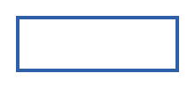
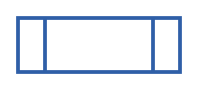
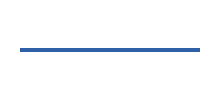
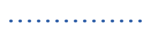

# 순서도의 기호
- 프로그램 순서도(program flowchart)
    - 기호와 도형으로 프로그램의 흐름을 표시해둔 차트
    - 순서도 기호(flowchart symbol)

- 순서도 작성법
    - 순서도는 위에서 아래로, 왼쪽에서 오른쪽으로 작성
    - 각 기호는 한 가지 기능만 수행
    - 화살표는 흐름의 방향을 명확히 표시
    - 조건문은 결정 기호를 사용하여 '예'와 '아니오' 경로 구분

## 주요 순서도 기호

| 구성 | 내용 | 모양 |
| --- | --- | --- |
| 데이터(data) | 데이터 입출력 |  |
| 처리(process) | 데이터 연산, 저장 등의 처리 |  |
| 미리 정의한 처리(predefined process) | 서브 루틴 및 모듈 등 다른 곳에서 이미 정의한 하나 이상의 연산 또는 명령어들로 이루어진 처리 |  |
| 판단(decision) | 조건에 따라 데이터의 흐름을 결정 |  |
| 단말(terminator) | 프로그램 흐름의 시작과 끝 |  |
| 선(line) | 기호 사이의 연결 관계를 표시 |  |
| 루프 범위(loop limit) | 반복문의 시작/종료 범위를 표시 |  |

## 선(line) 표기

| 종류 | 설명 | 모양 |
| --- | --- | --- |
| 실선 | 기본 처리 흐름   끊어진 곳 없이 이어진 선 |  |
| 점선 | 보조/참조/설명용 연결   일정한 간격으로 점을 찍어 이어진 선 |  |
| 파선 | 예외/조건부/선택적 흐름   긴 선과 짧은 선을 3 : 1의 비율로 이은 선 |  |
